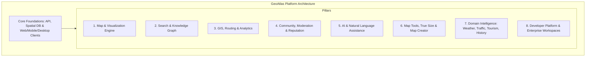

# GeoAtlas — Master Modular Product Roadmap & Feature Inventory

This document serves as the formal Product Requirements Document (PRD) and Modular Roadmap for **GeoAtlas**: an open, structured, global geographic knowledge platform.

---

## Current Platform State (Phases 1–3 Complete)

| Phase | Delivered Scope | Architecture / Package |
|---|---|---|
| **Phase 1 (Backend API)** | Multi-polygon admin levels, closure hierarchy, PostGIS spatial queries, OSRM routing, Meilisearch, presigned MinIO uploads, edit moderation engine. | `services/api` (Fastify + PostgreSQL 15/PostGIS 3.3) |
| **Phase 2 (Web Client)** | Next.js 14 SSR location pages, MapLibre GL JS vector tiles (Martin), split search view, compare tool, statistics dashboards, business reviews, community edit submission & moderation queue. | `web/` |
| **Phase 3 (Mobile & Desktop)** | Android native app (Expo / React Native) with `expo-secure-store` & SQLite 24h offline cache; Windows native app (Electron) with `keytar` Credential Manager integration; Shared `@geoatlas/core` workspace package. | `mobile/`, `desktop/`, `packages/core` |

---

## Modular Inventory & Strategic Grouping (38 Modules)

To maintain architectural stability and avoid monolithic bloat, all 450+ capabilities are categorized into 8 core functional pillars:



---

## 38-Module Capability Breakdown

### Pillar 1: Map & Visualization Engine
- **Module 1: Map & Visualization** (Interactive vector/raster, satellite, terrain, topo, 3D Globe, custom dark/light styles).
- **Module 11: Map Creator** (MapChart style: region painting, legend builder, PNG/SVG/PDF export).
- **Module 22: Photos & Media** (Storefront, 360°, drone imagery, street-level views).
- **Module 33: Accessibility** (Screen readers, high contrast, keyboard navigation, colorblind modes).

### Pillar 2: Geographic Hierarchy, Search & Knowledge Graph
- **Module 2: Search Engine** (Fuzzy, spatial bbox, autocomplete, reverse geocoding, Plus Codes).
- **Module 3: Geographic Hierarchy** (Earth → Continent → Region → Country → State → District → Taluk → Ward → Village → Postal → Street → Building).
- **Module 4: Location Pages** (Comprehensive profiles: Identity, Geography, Demographics, Economy, Infrastructure, Healthcare, Education, Tourism, History).
- **Module 24: Knowledge Graph** (Connected graph linking admin units, entities, businesses, statistics, and media).
- **Module 25: Data Explorer** (Facet-based catalog for rivers, mountains, airports, schools, hospitals).

### Pillar 3: GIS, Routing, True Size & Spatial Analytics
- **Module 10: True Size Engine** (Mercator projection distortion correction, interactive country/polygon comparison overlay).
- **Module 12: GIS Tools** (Buffer, Union, Intersect, Clip, Dissolve, Distance, Area, Viewshed, Watershed).
- **Module 13: Routing Engine** (Multi-modal OSRM routing: driving, walking, cycling, truck, isochrone reachability).
- **Module 14: Spatial Analytics** (Dashboards, density heatmaps, land use, demographic distribution).
- **Module 23: Global Statistics** (Aggregated population, GDP, climate, agriculture, energy, internet penetration).

### Pillar 4: Community, Moderation, Reputation & Editing
- **Module 5: Vector Map Editing** (Road editing, polygon drawing, snapping, split/merge, version history).
- **Module 6: Community Contributions** (User edits, photo uploads, corrections, comments, place discussions).
- **Module 7: Gamification & Reputation** (XP, levels, badges, regional/global leaderboards, trusted editor status).
- **Module 28: Collaboration** (Shared workspace maps, team assignments, approval workflows).
- **Module 29: Notifications** (Edit approval alerts, nearby change notifications, dataset updates).
- **Module 30: Moderation System** (Diff viewer, rollback engine, trust-tier permissions, spam detection).

### Pillar 5: AI & Natural Language Assistance (Deferred Phase Target)
- **Module 8: AI Assistant** (Natural language geographic queries, map explanation, duplicate detection, image OCR, auto-summarization).

### Pillar 6: Specialized Domain Modules
- **Module 9: Side-by-Side Comparison** (Metric tables: area, population, GDP, HDI, climate).
- **Module 15: Weather Intelligence** (Temperature, rain, AQI, radar overlays, climate normals).
- **Module 16: Environment & Natural Hazards** (Deforestation, wildfires, floods, earthquakes, sea level).
- **Module 17 & 19: Infrastructure & Public Services** (Road networks, transit, airports, hospitals, schools, police).
- **Module 18: Business Directory** (Contact info, hours, verified attributes, reviews, presigned uploads).
- **Module 20: Tourism & Culture** (Attractions, hiking trails, hotels, heritage sites).
- **Module 21: Historical Geography** (Timeline slider, historical boundary changes, old names).

### Pillar 7: Developer Platform, Data Management & Enterprise
- **Module 26: Developer Platform** (REST, GraphQL, SDKs, Vector tile endpoints, Webhooks).
- **Module 27: Import / Export** (GeoJSON, KML, GPX, Shapefile, TopoJSON, CSV, SVG, PDF).
- **Module 34 & 35: Security & Enterprise** (RBAC, audit logs, private workspaces, self-hosting, SSO).
- **Module 36: Plugin Ecosystem** (Custom map layers, routing adapters, analytics extensions).
- **Module 37: Data Management Pipelines** (ETL pipelines, scheduled imports, provenance tracking, duplicate resolution).
- **Module 38: Licensing & Attribution** (Automated source attribution for OSM/GeoNames/Wikidata, CC/ODbL license validation).

---

## Future Phase Sequencing Roadmap

```text
Phase 4: Map Creator & True Size Tools (Modules 10, 11, 27)
Phase 5: Gamification & Extended Community Features (Modules 6, 7, 29)
Phase 6: Advanced GIS & Environmental Analysis (Modules 12, 15, 16)
Phase 7: AI Geographic Assistant & Natural Language Engine (Module 8)
Phase 8: Enterprise Workspaces & Plugin Ecosystem (Modules 35, 36, 37)
```
